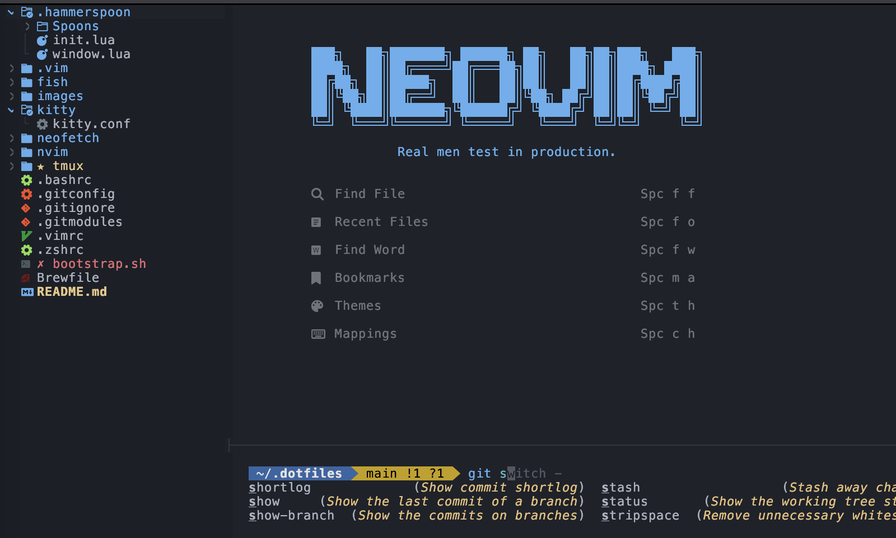

# Micah's Dotfiles



My personal dotfiles for macOS. This repository contains my configurations for Neovim, Vim, Hammerspoon, and the terminal. I have included a bootstrap script that will create the necessary symlinks for the configurations.

**Note**: This repository is a work in progress and is constantly being updated. Additionally, if you want to give these dotfiles a try, I recommend forking and reviewing the code before giving them a whirl.

## Setup Steps

### 1. Install Apple Command Line Tools

This will provide you with essential tools like git.

```bash
xcode-select --install
```

### 2. Clone Dotfiles Repo

Clone your dotfiles repository into a new hidden directory.

```bash
git clone https://github.com/micahkepe/dotfiles.git ~/.dotfiles
```

### 3. Initialize and Update Submodules

Initialize and update the git submodules to include dependencies like Vundle and YouCompleteMe.

```bash
cd ~./dotfiles
git submodule update --init --recursive
```

### 4. Install Homebrew

Only if it's not already installed.

```bash
/bin/bash -c "$(curl -fsSL https://raw.githubusercontent.com/Homebrew/install/HEAD/install.sh)"
```

### 5. Install Oh My Zsh

```bash
sh -c "$(curl -fsSL https://raw.githubusercontent.com/ohmyzsh/ohmyzsh/master/tools/install.sh)"
```

### 6. Install Packages and Apps with Homebrew (Command-Line Tools, Docker, etc.)

If you have a Brewfile in your dotfiles:

```bash
brew bundle install --file ~/.dotfiles/Brewfile
```

### 7. Install HammerSpoon

```bash
brew install --cask hammerspoon
```

### 8. Run Bootstrap Script

This will create the necessary symlinks for your configurations.

```bash
bash ~/.dotfiles/bootstrap.sh
```

### 9. Source Shell Configuration

Either open a new terminal session or source the configuration files with:

```bash
source ~/.zshrc
```

### 10. (Optional) Set Fish to Default Shell

To set [Fish](https://fishshell.com/) to be your default shell, first add the following line to `/etc/shells`:

```
/opt/homrebew/bin/fish
```

Then, run the following command:

```bash
chsh -s /opt/homebrew/bin/fish
```

If necessary, change following line in the `~/.config/fish/config.fish` file in the `Advanced` section:

```
# shell .
shell /opt/homebrew/bin/fish
```

And that's it! If you have any suggestions or questions feel free to open an issue or contact me.
